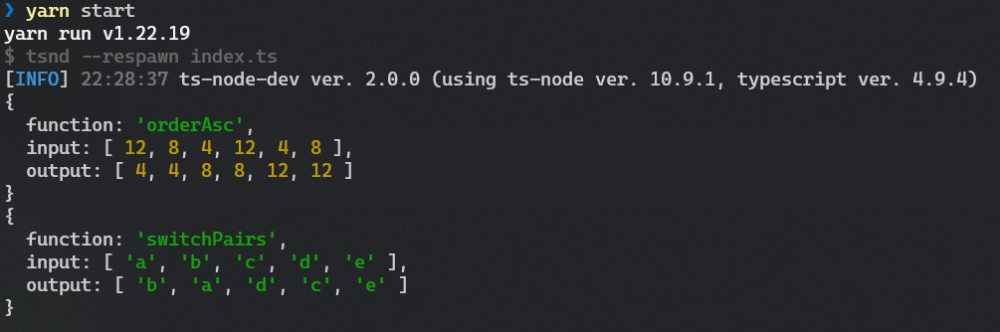
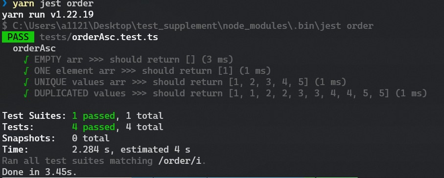
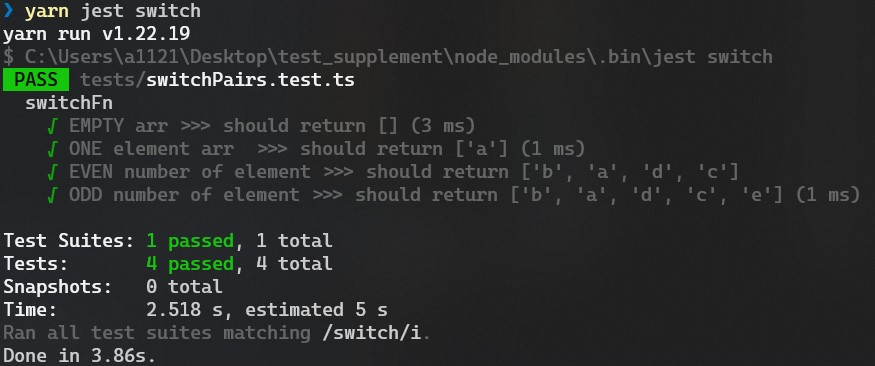

# Results

|               | `                                                                                                                                        |
|---------------|------------------------------------------------------------------------------------------------------------------------------------------|
| `description` | Write a function that sorts an array of numbers in ascending order using a for loop, without creating a new array or using array methods |
| `function`    | **orderAsc()**                                                                                                                           |
| `input`       | `[ 12, 8, 4, 12, 4, 8 ]`                                                                                                                 |
| `output`      | `[ 4, 4, 8, 8, 12, 12 ]`                                                                                                                 |

___

|               | `                                                                                            |
|---------------|----------------------------------------------------------------------------------------------|
| `description` | Replace the first element of the array with the second, the second with the third, and so on |
| `function`    | **switchPairs()**                                                                            |
| `input`       | `[ 'a', 'b', 'c', 'd', 'e' ]`                                                                |
| `output`      | `[ 'b', 'a', 'd', 'c', 'e' ]`                                                                |

# Tests

#### orderAsc()

#### switchPairs()

